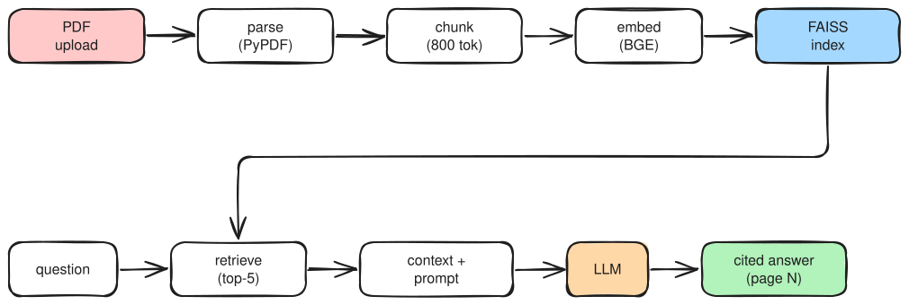

# Research-Assister

Chat with your research papers. Upload a PDF in the browser, and ask natural-language questions about it — a RAG pipeline chunks and embeds the document, retrieves the relevant passages from a FAISS index, and an LLM answers **grounded in those chunks with page citations**.



*To edit the diagram, open [`docs/pipeline.excalidraw`](docs/pipeline.excalidraw) — GitHub renders it in the file viewer, or drag the file onto [excalidraw.com](https://excalidraw.com).*

## What This Repo Contains

| Path | Purpose |
| --- | --- |
| `src/app/api/` | FastAPI application: upload + chat endpoints, lifespan setup, request schemas |
| `src/app/rag/` | The RAG pipeline: PDF loading, chunking, embeddings, FAISS vector store, prompt, chain |
| `src/app/models/` | `CustomLLM` — OpenAI-compatible chat-completions client (LangChain `LLM` subclass) |
| `src/app/exception/`, `src/app/logging/` | Custom exception wrapping and logging helpers |
| `frontend/` | React 18 + Vite web UI: PDF viewer + chat panel |
| `src/app/tests/rag_test.py` | Manual end-to-end test script (run it, don't pytest it) |
| `src/README.md` | Detailed backend architecture write-up |

## Backend (FastAPI)

Entry point is `src/app/api/main.py` — a FastAPI app whose **lifespan** loads the embedding model, the LLM client, and the persisted FAISS index into `app.state`. If no index exists yet, the app starts with `ready = False` and answers queries with `503` until a PDF is ingested.

### Endpoints

| Endpoint | Body | Behavior |
| --- | --- | --- |
| `POST /upload/pdf` | multipart form field `file` | Rejects non-PDFs (400). Saves the file to `uploads/`, then kicks off ingestion as a **background task** and returns `{"filename": ..., "status": "processing"}` immediately |
| `POST /chat/query` | `{"query": "..."}` (3–500 chars) | Retrieves top-5 chunks, builds a page-cited context, invokes the LLM, returns `{"answer": "..."}`. Returns `503` until an index is ready |
| `/docs` | — | Auto-generated OpenAPI docs |

CORS is currently open to all origins (marked dev-only in the code).

### The RAG pipeline

- **Chunking** (`rag/loader.py`): `PyPDFLoader` → `RecursiveCharacterTextSplitter.from_tiktoken_encoder` with `cl100k_base`, **800-token chunks / 150 overlap**, splitting on markdown headings and blank lines first.
- **Embeddings** (`rag/embedding.py`): `BAAI/bge-small-en-v1.5` (sentence-transformers, normalized, CPU by default).
- **Vector store** (`rag/vector_store.py`): FAISS, persisted at `vectorstore/bge_large/`. Retrieval prepends the BGE instruction prefix — `"Represent this sentence for searching relevant passages: "` — to the query.
- **Prompt** (`rag/prompt.py`): a strict system prompt — answer **only** from the provided context, refuse otherwise ("I cannot answer this question based on the provided documents."), always cite page numbers like `(page 3)`, show step-by-step math reasoning. Context blocks are formatted `[Page N]`.
- **LLM** (`models/cutsom_models.py`): a LangChain `LLM` subclass that POSTs to an **OpenAI-compatible chat-completions endpoint** (`requests`, `max_tokens=500`). Configured entirely via environment variables — no SDK lock-in.

### Configuration

Create `src/.env` (git-ignored) with:

```env
API_KEY=your-key-here
BASE_URL=https://your-openai-compatible-endpoint/v1/chat/completions
```

The code was written against Groq's API, but any endpoint matching the chat-completions shape works. The default model string is `gpt-4.1-mini`.

### Ingestion semantics

Each upload **replaces the index**: `rag/ingest.py` deletes the existing `vectorstore/bge_large/`, chunks + embeds the new PDF, builds a fresh FAISS index, and reloads it into `app.state` — so the assistant answers about the most recently uploaded document, not a merged corpus of all uploads.

## Frontend (React + Vite)

`frontend/` is a React 18 / Vite 5 app:

- **PDF panel** (`components/PdfViewer.jsx`): `react-pdf`/pdf.js renders every page in a scrollable column — read the paper and its chat answers side by side
- **Chat panel** (`components/ChatPanel.jsx`): message list, typing indicator, Enter-to-send
- **API layer** (`src/api/*.js`): plain `fetch` calls, currently **hardcoded to `http://localhost:8000`** — change it there if you host the backend elsewhere

## Getting Started

Requires **Python 3.11+** and Node.js.

```bash
# 1. Backend
uv sync                                   # from the repo root
cp src/.env .env 2>/dev/null || true      # create src/.env (see Configuration above)
cd src
../.venv/bin/uvicorn app.api.main:app --reload

# 2. Frontend (second terminal)
cd frontend
npm install
npm run dev                               # http://localhost:5173
```

Upload a PDF on the left (e.g. the `attention.pdf` sample that lives in `src/uploads/`), wait for indexing, and start asking questions.

## Notes

- The root `main.py` is an **empty placeholder** — the backend entry point is `src/app/api/main.py` served by uvicorn
- `streamlit` is listed in `pyproject.toml` but unused (leftover from an earlier prototype)
- `src/app/tools/tools.py` is a stub: the TODO there plans to turn retrieval into an agent **tool** (e.g. a math tool + RAG-as-a-tool) instead of plain RAG
- Vector indices (`src/vectorstore/`), uploads, logs, and `.env` are git-ignored
